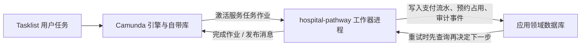

# est：外部工作器与领域数据库总指引

**主笔**：Estrella（陈格平）  
**日期**：2026-09-28  
**状态**：个人目录总指引；指导在 `Coursework/hospital-pathway/`（及可选中文学习版）上扩展外部工作器与受维护的领域数据库  
**范围**：说明更多工作器与应用侧数据库的目标、挂接点、分工与落地顺序；具体字段清单以领域库设计与各任务类型设计为准  
**行文**：正文用正向陈述（是什么、谁做、写什么）；易混概念用对照表划界，避免用「不是／不要／禁止」堆砌定义  
**成员 B 已落地**：[`Est/est：领域数据库设计.md`](est：领域数据库设计.md)；成员 B 占号工作器与 BPMN 挂接见第 6.3 节  
**工作器开发**：成员 **A、B、C、D 全员参与**（分工见第 6 节；进程对照完整体验路线）

**依据**（按阅读顺序）：

- 可执行包说明：`Coursework/hospital-pathway/README.md`
- 现有两个工作器行为：[`Est/est：治疗预约与付款外部工作器.md`](est：治疗预约与付款外部工作器.md)
- 完成定义中的外部工作器条款：`docs/definition-of-done.md`
- 产品待办：`docs/p3-product-backlog.md`（尤其 PB-03、PB-06、PB-07、PB-11、PB-20）
- 任务拆分：`docs/p4-work-breakdown.md`（尤其 T06、T09、T10、T11、T16）
- 全院可执行图：`Coursework/hospital-pathway/bpmn/W02_Hospital_All_Processes_Clean_Lines_Camunda8.bpmn`

---

## 1. 一句话目标

在课堂可演示的前提下，把医院路径里**必须对接外部系统的步骤**做成可订阅的 Java 作业工作器，并用**应用自己维护的领域数据库**保存支付流水、预约占用与审计事件，使重复执行仍对应同一笔流水或同一占用记录，且关键动作事后可查。

流程变量负责网关路由；领域数据库保存「这笔账记过没有、这个号约过没有、谁在何时做了什么」这类跨重试、跨演示可核对的事实。

---

## 2. 当前基线（写指引时的事实）

| 项目 | 现状 |
|------|------|
| 可执行工程 | 提交与演示用 `Coursework/hospital-pathway/`；可选学习镜像 `Ruby/hospital-pathway-zh-learn/`。同一时刻只启动其中一套 |
| 入口类 | `HospitalPathwayApplication.java` |
| 既有工作器类 | `HospitalPathwayWorkers.java`（`request-payment`、`send-booking-confirmation`） |
| 成员 B 工作器类 | `MemberBPathwayWorkers.java`（`check-slot`、`reserve-appointment`、`flag-resource-unavailable`） |
| 全院图上已挂 `taskDefinition` | 上述五类（既有两类 + 成员 B 三类） |
| 应用依赖 | Spring Boot + Camunda Client + JPA/H2 领域库（成员 B 已落地） |
| 业务状态存放处 | 流程变量 + 领域库表（成员 B 占号路径写 `booking_slot`；既有两类工作器仍以流程变量写回为主） |
| 本机 Camunda（c8run）自带库 | 存放引擎侧流程实例、作业与消息关联数据 |

概念阶段治疗预约图与说明在 `Est/`；可执行行为以全院包为准。全院包与旧个人文档冲突时，以全院包为准。

---

## 3. 两套存储：各存什么

| 存储 | 谁维护 | 存放内容 |
|------|--------|----------|
| Camunda / Zeebe 自带库 | c8run 等引擎发行版 | 流程实例、用户任务、服务任务作业、消息关联 |
| **应用领域数据库** | `hospital-pathway` Spring Boot 进程 | 支付流水、预约占用、审计事件、退款关联行；字段设计对齐 BR-07（仅金额、状态、参考号等业务必要项） |

课堂推荐：工作器同进程内使用**文件型 H2** + Spring Data JPA；`ddl-auto=update`（或小型迁移），演示关机后数据仍保留。

---

## 4. 更多外部工作器

全院图已画出外部泳池（外部排班、对外通信、支付服务商、保险方等）。产品待办与完成定义要求：外部排班、支付、不可用挂起、防重复等路径具备**可订阅的作业类型**与可核对证据（日志或表记录）。

### 4.1 既有工作器（稳定基线）

本阶段对下列方法体保持现状，新能力用新任务类型承接：

| 任务类型 | 演示主讲 | 与领域库 |
|----------|----------|----------|
| `request-payment` | 成员 A | `payment_ledger` 表已就绪；由后续支付域工作器按契约接入 |
| `send-booking-confirmation` | 成员 B | 行为见外部工作器文档；占号类已另挂 `check-slot` 等 |

行为细则见 [`est：治疗预约与付款外部工作器.md`](est：治疗预约与付款外部工作器.md)。新工作器写库顺序见第 5.2 节。

### 4.2 建议新增的工作器（A / B / C / D 各有一责）

每人至少一责一个（或一组）新任务类型；二责做代码复核与联调。任务类型字符串与 BPMN `taskDefinition` 保持同一拼写。

| 成员 | 演示进程（见完整体验路线） | 一责的新工作器（建议类型名） | 图上意图 / 待办锚点 | 主要写库 |
|------|---------------------------|------------------------------|---------------------|----------|
| **A** | P5、P7、P8、P13 | `request-refund`；可选 `mark-payment-investigate` | PB-07 / PB-20 / T11；线 10、13 | `payment_ledger`、相关 `audit_event` |
| **B** | P3、P4、P6 | `check-slot`；`reserve-appointment`；`flag-resource-unavailable` | PB-03 / PB-06 / T06 / T09；线 9–11、14 | `booking_slot`、相关 `audit_event` |
| **C** | P1、P2、P9 | `dispatch-clinic-letter`；`notify-referrer` | PB-09；线 5–8 与寄信段 | `audit_event`（及可选通信记录） |
| **D** | P10、P11、P12 | `notify-care-change`；可选 `ack-enquiry-routed` | PB-10 / PB-21；线 1–3、12、14 | `audit_event`；涉钱时只读 `payment_ledger` |

**领域库表结构**由成员 B 主责（已完成）。A / C / D 注入 B 公布的 Repository / `AuditEventWriter`，共用同一文件库。

医院图上的任务类型从本院路径与待办推导；优先覆盖「外部系统 + 可演示副作用」步骤。用户填表、临床决策、财务人工调查继续使用用户任务与表单。

### 4.3 新增工作器的固定落地顺序

1. 在设计说明中写清：读取哪些流程变量、写回哪些变量、失败时用 `fail` 还是业务错误码、是否发布 BPMN 消息。  
2. 在可执行 BPMN 上配置 `zeebe:taskDefinition`（与代码注解一致）。  
3. 在对应 `@Component`（如 `MemberBPathwayWorkers`）中增加 `@JobWorker(type = "...")`。  
4. 有外部副作用时，先写领域库再完成作业（见第 5.2 节）。  
5. 一责走通成功路径与至少一条失败 / 重试路径；二责复核代码与证据。  
6. 每人至少交叉复核另一人的一个工作器提交。

### 4.4 BPMN 与新工作器同步改（硬性）

新工作器交付时，全院可执行 BPMN 同步挂上同名 `taskDefinition`，并完成部署与路径复测。图与代码同一切片交付。

| 规则 | 要求 |
|------|------|
| 同源双包 | 先改 `Coursework/hospital-pathway/bpmn/W02_Hospital_All_Processes_Clean_Lines_Camunda8.bpmn`；若使用学习包则同步同名图 |
| 类型一致 | 图上 `type` 与 `@JobWorker(type=...)` 拼写一致 |
| 改图方式 | 在用户任务之后插入 `serviceTask` / `sendTask`；保留人工填表，外发交给工作器；既有 `RequestPayment` / `SendBookingConfirmation` 节点保持 |
| 完成门槛 | 一责工作器在 BPMN 挂类型、部署并跑通对应线路后，方可标该工作项 Done |
| 既有节点 | `request-payment`、`send-booking-confirmation` 已挂类型，本阶段保持图与方法体现状 |

**挂接位置（由各一责改图；成员 B 已完成本行）：**

| 成员 | 任务类型 | BPMN 挂接 |
|------|----------|-----------|
| A | `request-refund` | `FinanceAdjustment` 记录完成后进入 send/service，再进后续网关 |
| A | `mark-payment-investigate`（可选） | `FundingIssue` 路径上增加服务任务 |
| B | `check-slot` | `BookVisit` 之后、`VisitOutcome` 之前（**已挂**） |
| B | `reserve-appointment` | 资源就绪出口与 `SendBookingConfirmation` 之间（**已挂**） |
| B | `flag-resource-unavailable` | 资源 pending 出口与回到 `BookTreatment` 之间（**已挂**） |
| C | `dispatch-clinic-letter` | `DispatchLetter` 人工核对之后 |
| C | `notify-referrer` | `Redirect` 之后 |
| D | `notify-care-change` | `ClinicalChange` 之后、进入后续网关之前 |
| D | `ack-enquiry-routed`（可选） | 问询用户任务完成路径上 |

改图时更新节点 `documentation`：任务类型、一责成员、读写哪些领域表。Operate / Tasklist 复测后再交证据。

---

## 5. 受维护的领域数据库

流程变量适合课堂走网关；下列约束需要跨实例可核对的事实，由领域库承担：

| 约束 | 领域库做法 |
|------|------------|
| 工作器可安全重试、同一付款意图只对应一笔流水 | `payment_ledger.idempotency_key` 唯一 |
| 无合适号源时 pending、同一占用意图只对应一条占用 | `booking_slot.occupancy_key` 唯一 |
| 关键动作可查、审计只追加（PB-11） | `audit_event` + `AuditEventWriter.append` |
| 退款与原支付可关联（PB-20） | 流水行关联 `case_reference` |
| 财务字段仅保留业务必要项（BR-07） | 表结构只含金额、状态、参考号、日期等 |

### 5.1 首批表

**`payment_ledger`**

| 字段语义 | 说明 |
|----------|------|
| 病例号 `case_reference` | 与消息关联键一致 |
| 幂等键 | 病例号 + 本轮付款意图等；库内唯一 |
| 交易参考号、金额、状态、付款日期、创建时间 | 状态含成功、不成功、待调查 |

**`booking_slot`**

| 字段语义 | 说明 |
|----------|------|
| 病例号、占用键、时间窗说明 | 占用键唯一 |
| 状态 | confirmed / pending / escalated |
| 重试次数、最近重试时间、创建时间 | 支撑挂起与重试演示 |

**`audit_event`**

| 字段语义 | 说明 |
|----------|------|
| 操作者、动作、病例号、发生时间、摘要载荷 | 摘要只写短文本业务摘要 |
| 写入规则 | 仅 `append` 与查询 |

### 5.2 写库顺序（以支付类为例；占号同类）

1. 校验输入；无效则失败作业，库中仍无本意图的已请求标记。  
2. 用幂等键 / 占用键查询。  
3. 已有终态或待调查记录：沿用原参考号与状态，写回流程变量并完成作业；同一意图复用已有结果。  
4. 无记录：模拟外部结果 → 先插入行 → 再发消息（若需要）→ 再完成作业。  
5. 发布消息失败：减少重试并写明原因；使下次领取能读到已有流水并走步骤 3。

---

## 6. 成员 A / B / C / D 分工

进程划分与 [`Ruby/hospital-pathway-zh-learn/完整体验路线.md`](../Ruby/hospital-pathway-zh-learn/完整体验路线.md) 一致。  
A、B、C、D 每人都开发 JobWorker（至少一责一个新类型，并交叉复核另一人的一个工作器）。  
既有 `request-payment` / `send-booking-confirmation` 本阶段保持现状。

### 6.1 总表

| 成员 | 进程 | 演示主讲（已有 Java） | 一责开发的新 JobWorker | 二责（建议） | 领域库 |
|------|------|----------------------|------------------------|--------------|--------|
| **A** | P5、P7、P8、P13 | Java① `request-payment` | `request-refund`；可选 `mark-payment-investigate` | C 或 D | 读写 `payment_ledger`；写支付相关审计 |
| **B** | P3、P4、P6 | Java② `send-booking-confirmation` | `check-slot`；`reserve-appointment`；`flag-resource-unavailable` | A 或 C | 设计并维护领域库；写 `booking_slot` |
| **C** | P1、P2、P9 | 登记 / 转诊 / 寄信线 | `dispatch-clinic-letter`；`notify-referrer` | B 或 D | 写审计 |
| **D** | P10、P11、P12 | 问询 / 变更线 | `notify-care-change`；可选 `ack-enquiry-routed` | A 或 B | 写审计；涉钱时只读流水 |

### 6.2 协作规则

1. 每人一责至少一个新工作器；表单演示与 Java 开发都要有人落到证据上。  
2. 合并前由二责看代码、日志与表数据；复核人在证据或提交说明留名。  
3. 新 `taskDefinition` 加进全院 BPMN；实现放同一 Spring Boot 进程（可按成员拆 `@Component`）。图与代码同切片交付。  
4. 四人共用 B 落地的同一 H2 文件库与契约。  
5. Part 4 中的真名与演示代号 A/B/C/D 对齐，同一 `taskDefinition` 只由一责改。

### 6.3 状态（2026-09-28）

| 工作项 | 状态 |
|--------|------|
| 领域库三表 + 仓储 + 审计只写（成员 B） | 已完成 |
| 既有两个 JobWorker | 保持现状 |
| 成员 B 新工作器 + BPMN | 已完成（`check-slot` / `reserve-appointment` / `flag-resource-unavailable`） |
| 成员 A / C 新工作器 + BPMN | 由各自一责推进 |
| 成员 D（Ryan）：变更通知 + 问询回执 | 已认领并完成英文包代码、BPMN 挂接及本地验证（20 项 Java 测试、4 项图结构检查、8 个实际流程结束）；见 [D 说明](../Ryan/2026-09-28/D_外部工作器与数据库说明.md)及[证据](../evidence/PB-10_PB-21_member-D_workers_2026-09-28/README.md)。二责 A／B 复核待完成，合并前保持 In progress |

---

## 7. 推进切片

| 切片 | 做什么 | 一责 | 完成时可见证据 |
|------|--------|------|----------------|
| 1 | 文件型领域库 + 三张表 | B | 启动日志「领域库就绪」；`data/hospital-domain` 存在 |
| 2 | BPMN + 排班占号 / 资源不可用工作器 | B（A 或 C 复核） | 图上有类型；pending / 占用可演示 |
| 3 | BPMN + 诊后信外发 / 转诊方通知 | C（B 或 D 复核） | 图上有类型；日志 SENT；审计可查 |
| 4 | BPMN + 变更通知（+ 可选问询回执） | D（A 或 B 复核） | 图上有类型；变更通知可演示 |
| 5 | BPMN + 退款（+ 可选待调查） | A（C 或 D 复核） | 图上有类型；流水可追溯 |
| 6 | 各一责在完成路径上调用 `AuditEventWriter` | A/B/C/D | 按病例号可查出写入事件 |

切片 1、2（成员 B）已完成。切片 3–5 由对应一责推进；先冻结类型名字符串，再改图与写代码。

---

## 8. 工程与协作约定

1. 同一时刻只开一套工作器工程（英文包或学习包二选一）。  
2. 领域库路径写在 `application.yaml`；启动与查表方式写进 `Coursework/hospital-pathway/README.md`。  
3. 若保留学习包：领域库与 BPMN 与英文包同步，或明确只维护英文包、学习包随后合并。  
4. 完成定义曾写 `src/workers/`；本组可执行代码在 `Coursework/hospital-pathway/`，目录差异记为已知限制。  
5. 仓库内使用演示账号与模拟数据；卡号与真实患者资料留在课堂边界之外。  
6. BPMN `taskDefinition`、Java `@JobWorker(type=...)`、本文类型名三者拼写一致。

---

## 9. 本阶段范围（正向）

| 纳入本阶段 | 说明 |
|------------|------|
| 应用领域库（H2 文件 + 三表） | 成员 B 已落地 |
| 成员 B 占号 / 资源不可用工作器与 BPMN | 已落地 |
| 成员 A / C / D 各自新工作器与 BPMN | 由各一责按第 4.4、6 节推进 |
| 用户任务与表单 | 继续承担行政填表、临床决策、财务人工调查 |
| 既有两类 JobWorker | 保持现状；新能力用新类型承接 |
| 课堂边界 | 本地 Camunda + mock 外部服务；财务字段仅业务必要项 |

引擎自带库只服务流程运行；业务账本与占用记录写在应用领域库。工作器先挂 `taskDefinition` 再订阅，图与代码一并交付。

---

## 10. 与已有个人文档的关系

| 文档 | 关系 |
|------|------|
| [`est：领域数据库设计.md`](est：领域数据库设计.md) | 成员 B 领域库字段契约与实现位置 |
| [`est：治疗预约与付款外部工作器.md`](est：治疗预约与付款外部工作器.md) | 既有两类任务的输入输出与错误语义 |
| [`est：治疗预约与付款流程变量设计.md`](est：治疗预约与付款流程变量设计.md) | 网关与表单变量名；库表为旁路事实源，完成作业时写回约定变量 |
| [`est：成员B演示指导.md`](est：成员B演示指导.md) | 演示脚本；占号与库表核对可加进对应步骤 |
| `Est/参考/治疗预约与付款的分步完成计划.md` | 个人参考计划；范围与第 9 节对齐 |

字段级定稿、类名拆分、审计只追加的演示方式，由对应待办负责人另文写出并回链第 5、6 节。

---

## 11. 自检清单

- [ ] 能说明引擎库与领域库各自存放什么  
- [ ] 能说明 A / B / C / D 各自一责的新工作器  
- [ ] 拟新增的 `@JobWorker` 已在 BPMN 有同名 `taskDefinition`，双包（若使用）已对齐  
- [ ] 证据同时包含「图上节点」与「Java 日志 / 表数据」  
- [ ] 防重复落在数据库唯一约束  
- [ ] 财务相关列仅为金额、状态、参考号、日期等业务必要项  
- [ ] 启动顺序：先 Camunda，再 Java；只开一套工程；库文件在 `Coursework/hospital-pathway/data/`  
- [ ] 证据路径对应 PB / Task；二责复核人已留名  

---

**本文用途**：Est 侧对「外部工作器 + 受维护领域数据库」的总指引。实施以全院可执行包为准；类型名或表名全组决议后回写第 4.2 与第 5.1 节。
