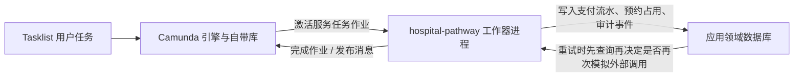

# est：外部工作器与领域数据库总指引

**主笔**：Estrella（陈格平）  
**日期**：2026-09-28  
**状态**：个人目录总指引；指导后续在 `Coursework/hospital-pathway/`（及可选中文学习版）上扩展外部工作器与受维护的领域数据库  
**范围**：说明「为什么还要更多工作器」「为什么还要应用侧数据库」「先改哪里、后改哪里」；不替代具体任务类型设计与字段清单  
**成员 B 领域库设计落地**：[`Est/est：领域数据库设计.md`](est：领域数据库设计.md)（三张表 + 仓储已进 `Coursework/hospital-pathway`；**未**改动既有两个 JobWorker）  
**工作器开发**：成员 **A、B、C、D 全员参与**（分工见第 6 节；进程对照完整体验路线）

**依据**（按阅读顺序）：

- 可执行包说明：`Coursework/hospital-pathway/README.md`
- 现有两个工作器行为：[`Est/est：治疗预约与付款外部工作器.md`](est：治疗预约与付款外部工作器.md)
- 完成定义中的外部工作器条款：`docs/definition-of-done.md`
- 产品待办：`docs/p3-product-backlog.md`（尤其 PB-03、PB-06、PB-07、PB-11、PB-20）
- 任务拆分：`docs/p4-work-breakdown.md`（尤其 T06、T09、T10、T11、T16）
- 全院可执行图：`Coursework/hospital-pathway/bpmn/W02_Hospital_All_Processes_Clean_Lines_Camunda8.bpmn`

---

## 1. 一句话目标

在课堂可演示的前提下，把医院路径里**必须对接外部系统的步骤**做成可订阅的 Java 作业工作器，并用**应用自己维护的领域数据库**保存支付流水、预约占用与审计事件，使重复执行不会产生第二笔扣款或第二个预约，且关键动作事后可查。

流程变量继续负责网关路由；领域数据库负责「这笔账记过没有、这个号约过没有、谁在何时做了什么」这类跨重试、跨演示可核对的事实。

---

## 2. 当前基线（写指引时的事实）

| 项目 | 现状 |
|------|------|
| 可执行工程 | `Coursework/hospital-pathway/`（提交与演示用英文包）；`Ruby/hospital-pathway-zh-learn/` 为可选中文学习镜像，**不要与英文包同时启动** |
| 入口类 | `HospitalPathwayApplication.java` |
| 工作器类 | `HospitalPathwayWorkers.java` |
| 已订阅的任务类型 | `request-payment`（发消息 `payment-result` 后完成作业）、`send-booking-confirmation`（写回 `confirmation_sent`） |
| 全院图上的服务任务类型 | 目前仅上述两处配置了 `zeebe:taskDefinition`；**A/B/C/D 新工作器上线时必须按第 4.4 节改 BPMN** |
| 应用依赖 | Spring Boot + Camunda Client + **JPA/H2 领域库**（成员 B 已落地） |
| 业务状态存放处 | 流程变量 + 领域库表（新工作器写入；既有两个 JobWorker 本阶段仍主要写变量） |
| 本机 Camunda（c8run）自带库 | 只服务引擎（流程实例、作业、消息等），**不是**医院业务库 |

概念阶段的治疗预约图与说明仍在 `Est/`；新能力以全院可执行包为准，旧文档中与全院包冲突的表述以全院包为准。

---

## 3. 两套存储，不要混用

| 存储 | 谁维护 | 存什么 | 不存什么 |
|------|--------|--------|----------|
| Camunda / Zeebe 自带库 | c8run 等引擎发行版 | 流程实例、用户任务、服务任务作业、消息关联 | 患者账户账本、防重复占用记录、组内可演示的审计查询结果 |
| **应用领域数据库**（本指引要求新建） | `hospital-pathway` Spring Boot 进程 | 支付流水、预约占用、审计事件、日后退款关联 | 完整卡号、安全码、病历正文；也不要把引擎库当业务库直接改表 |

课堂推荐：在工作器同一进程内使用**文件型 H2**（或同等文件库）+ Spring Data JPA。模式用可持续数据的配置（例如 `ddl-auto=update` 或小型迁移），**不要用每次关机清空 schema 的 `create-drop`**，否则无法称为受维护。

---

## 4. 为什么还要更多外部工作器

全院图已经画出外部泳池（外部排班、对外通信、支付服务商、保险方等），但多数外部交互仍由**用户任务完成**来模拟。产品待办与完成定义要求：外部排班、支付、不可用挂起、防重复等路径要有**可订阅的作业类型**与可核对证据（日志或 mock 记录）。

### 4.1 已有工作器（稳定基线，本阶段不回头改方法体）

| 任务类型 | 演示主讲 | 与数据库的关系（后续新工作器按同契约接入） |
|----------|----------|---------------------------------------------|
| `request-payment` | 成员 A | 领域库已有 `payment_ledger`；**本阶段不改**该方法体 |
| `send-booking-confirmation` | 成员 B | 可选日后写通信记录；**本阶段不改**该方法体 |

行为细则仍以 [`est：治疗预约与付款外部工作器.md`](est：治疗预约与付款外部工作器.md) 为准。新工作器接入库时按第 5.2 节「先查再写」；不要求回头改造上述两个方法。

### 4.2 建议优先新增的工作器（A / B / C / D 各有一责）

四人都要参与 JobWorker 开发：每人至少一责一个（或一组）新任务类型；二责做代码复核与联调。任务类型字符串定稿后须与 BPMN `taskDefinition` 完全一致。

| 成员 | 演示进程（见完整体验路线） | 一责的新工作器（建议类型名，可微调） | 图上意图 / 待办锚点 | 主要写库 |
|------|---------------------------|--------------------------------------|---------------------|----------|
| **A** | P5、P7、P8、P13 | `request-refund`；可选 `mark-payment-investigate`（服务商已扣款无回执） | PB-07 / PB-20 / T11；线 10、13 经费与退款 | `payment_ledger`、相关 `audit_event` |
| **B** | P3、P4、P6 | `check-slot` 或 `reserve-appointment`；`flag-resource-unavailable`（外部治疗/检验/影像不可用） | PB-03 / PB-06 / T06 / T09；线 9–11、14 预约侧 | `booking_slot`、相关 `audit_event` |
| **C** | P1、P2、P9 | `dispatch-clinic-letter`（对外通信发已批准诊后信）；`notify-referrer`（拒绝/转专科后通知转诊方） | PB-09 / P1–P2 门禁后的对外通知；线 5–8 与寄信段 | 可选通信日志表或先写 `audit_event` |
| **D** | P10、P11、P12 | `notify-care-change`（正式变更/取消/DNA 后通知相关方）；可选 `ack-enquiry-routed`（问询已分流的外部回执 mock） | PB-10 / PB-21；线 1–3、12、14 变更段 | 相关 `audit_event`；若涉及已付款变更则只读 `payment_ledger` 不直接改流水 |

**领域库设计与落地（表结构）**仍由 **成员 B** 主责（已完成）；A / C / D 开发工作器时按 B 公布的契约注入 Repository / `AuditEventWriter`，不各自另起库文件。

**不要**把课堂订单示例里的库存检查、发货等任务类型原样搬进医院图。**不要**为每个用户任务都做成工作器；优先「外部系统 + 可演示副作用」步骤。

### 4.3 新增工作器的固定落地顺序

对每一个新任务类型，按同一顺序推进，避免「代码已写、图上没有类型」或「图上有类型、无人订阅」：

1. 在设计说明中写清：读取哪些流程变量、写回哪些变量、失败时用 `fail` 还是业务错误码、是否发布 BPMN 消息。  
2. 在可执行 BPMN 上配置 `zeebe:taskDefinition`（类型字符串与代码注解完全一致）。  
3. 在 `HospitalPathwayWorkers`（或按成员拆出的 `@Component`，如 `MemberCLetterWorkers`）中增加 `@JobWorker(type = "...")`。  
4. 若有外部副作用，先写领域库再完成作业（或按第 5 节幂等顺序）。  
5. 一责走通成功与至少一条失败 / 重试路径；**二责**复核代码与证据。  
6. 四人互相做一次交叉复核：每人至少复核另一人的一个工作器 PR / 提交。

### 4.4 BPMN 必须随新工作器同步改进（硬性）

**新内容（领域库契约 + A/B/C/D 新 JobWorker）落地后，全院可执行 BPMN 必须跟着改。**  
只写 Java、不改图 → 引擎不会投递作业，演示与完成定义都不成立。

| 规则 | 要求 |
|------|------|
| 同源双包 | 先改 `Coursework/hospital-pathway/bpmn/W02_Hospital_All_Processes_Clean_Lines_Camunda8.bpmn`；若保留中文学习包，同步改 `Ruby/hospital-pathway-zh-learn/bpmn/` 同名图 |
| 类型一致 | 图上 `zeebe:taskDefinition type="..."` 与 `@JobWorker(type = "...")` 字符串完全一致 |
| 改图方式 | 优先在用户任务**之后**插入 `serviceTask` / `sendTask`（保留人工填表，外发交给工作器）；不要删掉既有 `RequestPayment` / `SendBookingConfirmation` |
| 完成门槛 | 某一责的工作器未在 BPMN 挂上类型并部署跑通前，不得标该工作项 Done |
| 既有节点 | `request-payment`、`send-booking-confirmation` 已挂类型，本阶段不改其方法体；图上这两处保持 |

**建议挂接位置（定稿类型名后由一责改图）：**

| 成员 | 任务类型（建议） | BPMN 改法（相对现有节点） |
|------|------------------|---------------------------|
| A | `request-refund` | 在 `FinanceAdjustment`（同意退款/转账）**之后**增加 send/service 任务，再进入后续网关或结束 |
| A | `mark-payment-investigate`（可选） | 在支付失败 / `FundingIssue` 路径上增加服务任务，或由 FundingIssue 完成后进入 |
| B | `check-slot` / `reserve-appointment` | 在 `BookVisit` 填表**之后**、到诊网关**之前**（或与到诊结果分支配合）增加占号服务任务；治疗侧可在 `BookTreatment` 确认资源后、现有 `SendBookingConfirmation` **之前**增加 |
| B | `flag-resource-unavailable` | 在 `BookTreatment` 选「资源不可用」出口后增加服务任务，写 `booking_slot` pending 并通知 |
| C | `dispatch-clinic-letter` | 将对外发信从纯用户任务拆出：保留 `DispatchLetter` 人工核对，**之后**增加 send/service 任务对接 Correspondence 泳池 |
| C | `notify-referrer` | 在 `Redirect`（及拒绝结束前若需通知）**之后**增加通知转诊方的服务任务 |
| D | `notify-care-change` | 在 `ClinicalChange` 授权变更**之后**、分网关去财务/出院前，增加通知服务任务 |
| D | `ack-enquiry-routed`（可选） | 在三条问询用户任务完成前或完成后增加 mock 回执服务任务 |

改图时更新节点 `documentation`：写明任务类型、一责成员、读写哪些领域表。Operate / Tasklist 复测对应线路后再交证据。

---

## 5. 为什么还要受维护的领域数据库

仅靠流程变量可以实现课堂演示，但无法稳定满足下列约束：

| 约束 | 仅用流程变量时的问题 | 领域库如何支撑 |
|------|----------------------|----------------|
| 工作器可安全重试、禁止重复扣款 | `payment_requested_once` 绑在单次流程实例上；重开实例或调查路径难以证明「没有第二笔」 | 支付流水表用幂等键唯一约束 |
| 无合适号源时 pending、禁止重复预约 | 用户任务勾选无法跨实例防重复 | 预约占用表记录状态与占用键 |
| 关键动作可查、普通用户不可改（PB-11） | Operate 历史不等于组内可交的审计证据 | 审计事件表只允许插入与查询 |
| 退款挂在患者账户并与原支付关联（PB-20） | 变量随实例结束难以当账户 | 支付流水与退款行关联 `case_reference` |
| 不得存储完整卡号（案例与 BR-07） | — | 表结构从设计起就不含卡号字段 |

### 5.1 建议的首批表

以下为最小集合；字段名定稿时可再出单独字段清单，但语义不要缩水。

**支付流水表（建议名 `payment_ledger`）——最先做**

| 字段语义 | 说明 |
|----------|------|
| 病例号 `case_reference` | 与消息关联键一致 |
| 幂等键 | 例如病例号 + 本轮付款意图标识；库内唯一 |
| 交易参考号 `transaction_reference` | 模拟成功时生成；失败可空 |
| 金额、状态、付款日期 | 状态含成功、不成功、待调查等 |
| 创建时间 | 应用写入 |

**预约占用表（建议名 `booking_slot`）——与排班类工作器一起做**

| 字段语义 | 说明 |
|----------|------|
| 病例号、时间窗或资源键 | 构成防重复占用 |
| 状态 | 例如 confirmed / pending / escalated |
| 重试次数或最近重试时间 | 支撑 PB-06 |

**审计事件表（建议名 `audit_event`）——可与支付错开半步，但表结构宜早预留**

| 字段语义 | 说明 |
|----------|------|
| 操作者、动作性质、病例号、发生时间 | 对齐全组审计字段约定 |
| 摘要载荷 | 短文本即可；不含卡号与病历正文 |
| 写入规则 | 应用只提供插入与查询；不提供更新与删除接口 |

### 5.2 工作器访问领域库的推荐顺序（以支付为例）

1. 校验输入（病例号等）；无效则失败作业，**不写**「已请求过」类标记。  
2. 用幂等键查询支付流水表。  
3. 若已有终态或待调查记录：沿用原交易参考号与状态，写回流程变量，完成作业；**不再次**模拟扣款、**不再次**发布会制造第二笔扣款语义的消息（若消息必须补发，须有单独设计且不得生成新交易参考号）。  
4. 若无记录：模拟外部结果 → **先插入流水** → 再发布 `payment-result` → 再完成作业。  
5. 若发布消息失败：减少重试并说明原因；流水是否已插入须与重试策略一致（宁可让下次领取读到已有流水并走步骤 3，也不要插入两条成功流水）。

预约类工作器采用同一模式：先查占用表，再决定确认或 pending。

---

## 6. 成员 A / B / C / D 分工（已定）

进程划分与 [`Ruby/hospital-pathway-zh-learn/完整体验路线.md`](../Ruby/hospital-pathway-zh-learn/完整体验路线.md) 一致。  
**硬性约定：A、B、C、D 四人都必须参与 JobWorker 开发**（每人至少一责一个新工作器；并至少交叉复核另一人的一个工作器）。  
已上线的 `request-payment` / `send-booking-confirmation` 为稳定基线，**本阶段不回头改方法体**。

### 6.1 总表

| 成员 | 进程 | 演示主讲（已有 Java） | 一责开发的新 JobWorker | 二责（建议） | 领域库 |
|------|------|----------------------|------------------------|--------------|--------|
| **A** | P5、P7、P8、P13 | Java① `request-payment`（已有，不改） | `request-refund`；可选 `mark-payment-investigate` | C 或 D | 读写 `payment_ledger`；写支付相关审计 |
| **B** | P3、P4、P6 | Java② `send-booking-confirmation`（已有，不改） | `check-slot` / `reserve-appointment`；`flag-resource-unavailable` | A 或 C | **设计并维护领域库**（已完成）；写 `booking_slot` |
| **C** | P1、P2、P9 | 登记 / 转诊 / 寄信线（用户任务为主） | `dispatch-clinic-letter`；`notify-referrer` | B 或 D | 写审计；可选通信发送记录 |
| **D** | P10、P11、P12 | 问询 / 变更线（用户任务为主） | `notify-care-change`；可选 `ack-enquiry-routed` | A 或 B | 写审计；变更涉钱时只读流水 |

### 6.2 协作规则

1. **每人一责至少一个新工作器**：不得出现「只有 A/B 写 Java、C/D 只讲表单」的交付结构。  
2. **交叉复核**：合并前由二责看代码、日志与（如有）表数据；复核人须在证据或 PR 说明里留名。  
3. **一张图、一个工程**：新 `taskDefinition` **必须**加进全院 BPMN（见第 4.4 节）；实现放同一 Spring Boot 进程（可用多个 `@Component` 类按成员拆分文件）。**禁止**「代码已合并、图未改」。  
4. **一个领域库**：只使用 B 落地的 H2 文件库与契约；禁止四人各建各的库文件。  
5. **与 Part 4 姓名对齐**：若 `docs/p4-work-breakdown.md` 中 T06/T09/T10 等仍写 Ender/Ryan 等真名，应标注其对应的演示代号（A/B/C/D），或改挂到本表一责，避免同一任务类型多人抢改。

### 6.3 状态（2026-09-28）

| 工作项 | 状态 |
|--------|------|
| 领域库三表 + 仓储 + 审计只写（成员 B） | **已完成** |
| 既有两个 JobWorker | 保持不动 |
| A / B / C / D 各自新工作器 | **仅成员 B 已挂 BPMN + Java**（`check-slot` / `reserve-appointment` / `flag-resource-unavailable`）；A/C/D **未做** |
| **全院 BPMN 按第 4.4 节挂接新任务类型** | **成员 B 部分已完成**；其余成员自行改图，禁止代写 |

---

## 7. 推荐的整体推进切片

按「每一刀都能演示、都能留下证据」切开。切片编号与成员代号无关。

| 切片 | 做什么 | 一责 | 完成时可见证据 |
|------|--------|------|----------------|
| 1 | 文件型领域库 + 三张表（**不**改既有 JobWorker） | B | 启动日志「领域库就绪」；`data/hospital-domain` 存在 |
| 2 | **改 BPMN** + 实现排班占号 / 资源不可用 `@JobWorker` | B（A 或 C 复核） | 图上有 `taskDefinition`；pending / 防重复可演示 |
| 3 | **改 BPMN** + 诊后信外发 / 转诊方通知工作器 | C（B 或 D 复核） | 图上有类型；日志 SENT；审计可查 |
| 4 | **改 BPMN** + 变更通知（+ 可选问询回执）工作器 | D（A 或 B 复核） | 图上有类型；变更后通知可演示 |
| 5 | **改 BPMN** + 退款（+ 可选待调查）工作器 | A（C 或 D 复核） | 图上有类型；流水可追溯 |
| 6 | 各一责在本人工作器完成路径上调用 `AuditEventWriter` | A/B/C/D | 按病例号可查出写入事件 |

切片 1 已完成。切片 2–5 **每一刀都包含 BPMN 改进**；先全组冻结 `taskDefinition` 字符串，再改图与写代码（可并行，但图与代码必须同一切片内一起交付）。

---

## 8. 工程与协作约定

1. **只开一套工作器工程**：英文提交包与中文学习版订阅相同任务类型；同时启动会导致争抢作业与重复部署风险。  
2. **领域库路径写进配置**：例如在 `application.yaml` 中固定文件库位置，并在 `Coursework/hospital-pathway/README.md` 说明如何启动与如何查看表内容（H2 控制台或 SQL 查询）。  
3. **中英文包同步策略**：若学习版继续保留，领域库改造应双包同步或明确「只维护英文包、学习版随后合并」，避免演示讲一套、仓库跑另一套。  
4. **完成定义路径差异**：DoD 曾写 `src/workers/`；本组可执行代码实际在 `Coursework/hospital-pathway/`。目录差异记为已知限制即可，不必为对齐路径而拆工程。  
5. **秘密与隐私**：不向仓库提交真实患者资料、卡号、生产口令；演示账号可用 `demo`。  
6. **命名一致**：BPMN `taskDefinition`、Java `@JobWorker(type=...)`、本指引与字段清单中的任务类型字符串必须同一拼写。

---

## 9. 现在明确不做的事

- 不把 Camunda 引擎自带库当作医院业务库直接改表、直接查账。  
- 不在表单、日志或领域库中保存完整卡号、安全码或病历正文。  
- 不把所有用户任务改成服务任务；行政填表、临床决策、财务人工调查仍以用户任务与表单为主。  
- 不在未配置 `taskDefinition` 之前先写无法被引擎投递的工作器；**也不允许**工作器已写完却不改 BPMN（见第 4.4 节）。  
- 不引入与课堂范围无关的微服务拆分、云托管数据库或真实支付网关对接（除非课程另行要求）。  
- **本阶段不回头修改**已实现的 `request-payment` / `send-booking-confirmation` 方法体；新需求用新工作器与领域库承接，并同步改全院图。

---

## 10. 与已有个人文档的关系

| 文档 | 关系 |
|------|------|
| [`est：领域数据库设计.md`](est：领域数据库设计.md) | 成员 B 领域库字段契约与实现位置；本指引第 6 节分工的库侧落地说明 |
| [`est：治疗预约与付款外部工作器.md`](est：治疗预约与付款外部工作器.md) | 两个既有任务类型的输入输出与错误语义；本指引在其上增加「领域库与更多工作器」的总顺序 |
| [`est：治疗预约与付款流程变量设计.md`](est：治疗预约与付款流程变量设计.md) | 网关与表单仍读这些变量名；库表是旁路事实源，完成作业时仍须写回约定变量 |
| [`est：成员B演示指导.md`](est：成员B演示指导.md) | 演示脚本；引入库与新工作器后，应在对应步骤增加「何时打开库表或日志核对」的检查点 |
| `Est/参考/治疗预约与付款的分步完成计划.md` | 个人参考计划；其中「现在不做退款自动化」等边界与本指引第 9 节一致 |

字段级定稿、具体 Java 类名拆分、审计「拒绝修改」的演示方式，由对应待办负责人另文写出，并回链到本指引第 5、6 节。

---

## 11. 自检清单（开工前与演示前）

- [ ] 说得出引擎库与领域库各自存什么  
- [ ] 说得出 A / B / C / D 各自一责的新工作器（见第 6 节），且四人都有开发任务  
- [ ] 每个拟新增的 `@JobWorker` 是否已在 **BPMN** 上有同名 `taskDefinition`，且 Coursework（及若使用的 zh-learn）双包已对齐  
- [ ] 切片 2–5 的证据是否同时包含「图上节点」+「Java 日志 / 表数据」  
- [ ] 防重复是否落在数据库唯一约束，而不是只靠口头约定  
- [ ] 表结构是否从设计起就没有卡号字段  
- [ ] 已知：先启 Camunda，再启 Java；只开一套工程；库文件在 `Coursework/hospital-pathway/data/`  
- [ ] 证据路径是否能对应到 PB / Task 的 Evidence 列；二责复核人已留名  

---

**本文用途**：作为 Est 侧对「更多外部工作器 + 受维护领域数据库」的总指引。实施时以全院可执行包为准；若全组对任务类型命名或表名有统一决议，应回写本文件第 4.2 节与第 5.1 节，避免口头约定漂移。
