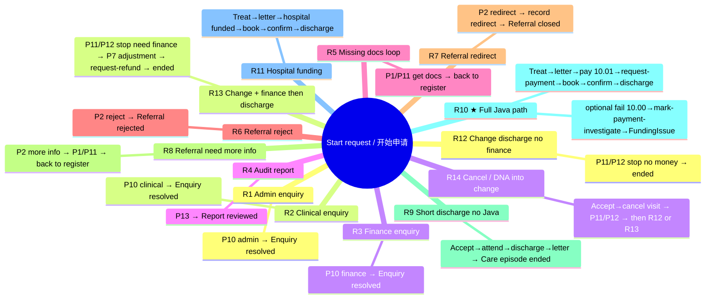

# 完整线路图 / Full path guide（按「一条线走到底」）

对照 Tasklist / 流程图上的任务标题填写。  
Match the task titles in Tasklist / the BPMN diagram.

每一步只写**最影响下一步去哪**的选项；其它字段（病例号、备注等）随便填满必填即可。  
At each step, only the option that **routes the next step** matters; fill other required fields freely.

病例号建议全程：`DEMO-001`（Java 线可用 `DEMO-JAVA-01`）。  
Suggested case ID: `DEMO-001` (use `DEMO-JAVA-01` on the Java path).

中文界面：`Ruby/hospital-pathway-zh-learn`　｜　English UI: `Coursework/hospital-pathway`  
选项中英文对照见下方【选】行（左中 / 右英）。

---

## 分工对照 / Role split（进程 ↔ 线 · Process ↔ Route）

| 同学 Member | 进程 Process | 对应线 Routes | 新 JobWorker（一责）|
|-------------|--------------|---------------|---------------------|
| **A** | P5、P7、P8、P13 | 线 4；线 10；线 11（经费段）；线 13 | `request-refund`；`mark-payment-investigate`（另主讲既有 `request-payment`） |
| **B** | P3、P4、P6 | 线 9；线 10/11（预约）；线 14 | `check-slot`；`reserve-appointment`；`flag-resource-unavailable`（另主讲 `send-booking-confirmation`） |
| **C** | P1、P2、P9 | 线 5–8；线 9/10/11（登记/转诊/寄信） | `dispatch-clinic-letter`；`notify-referrer`（待落地） |
| **D** | P10、P11、P12 | 线 1–3；线 12；线 14 | `notify-care-change` |

> 一条线跨多人时，各讲自己的 P / Worker。  
> **A 的 Java**：线 10 → `request-payment`（①）；金额 `10.00` 失败 → `mark-payment-investigate`；线 13 → `request-refund`。  
> **B 的 Java**：占号三类 + 线 11 `send-booking-confirmation`（②）。

---

## 总览思维导图 / Overview mind map



---

## 线 1｜P10 行政问询 → 问询已解决  
## Route 1｜P10 Administrative enquiry → Enquiry resolved

```
开始申请 / Start request
  → P1 / P10 / P13　登记申请；核验材料与身份
     Register request; check documents and ID
       【选】申请类型 = 行政问询 / Administrative enquiry
  → P10　处理行政问询；记录答复
     Resolve administrative enquiry; record response
       【选】结果 = 已完成并记录 / Completed and recorded
  → 【终点】问询已解决 / Enquiry resolved
```

---

## 线 2｜P10 临床问询 → 问询已解决  
## Route 2｜P10 Clinical enquiry → Enquiry resolved

```
开始申请 / Start request
  → P1 / P10 / P13　登记申请；核验材料与身份
     Register request; check documents and ID
       【选】申请类型 = 临床问询 / Clinical enquiry
  → P10　专科护士 / 医生答复并记录临床建议
     CNS / clinician responds and records clinical advice
       【选】结果 = 已完成并记录 / Completed and recorded
  → 【终点】问询已解决 / Enquiry resolved
```

---

## 线 3｜P10 财务问询 → 问询已解决  
## Route 3｜P10 Financial enquiry → Enquiry resolved

```
开始申请 / Start request
  → P1 / P10 / P13　登记申请；核验材料与身份
     Register request; check documents and ID
       【选】申请类型 = 财务问询 / Financial enquiry
  → P10　财务答复支付 / 经费问询
     Finance responds to payment / funding enquiry
       【选】结果 = 已完成并记录 / Completed and recorded
  → 【终点】问询已解决 / Enquiry resolved
```

---

## 线 4｜P13 审计报告 → 报告已审阅  
## Route 4｜P13 Audit report → Report reviewed

```
开始申请 / Start request
  → P1 / P10 / P13　登记申请；核验材料与身份
     Register request; check documents and ID
       【选】申请类型 = 管理审计 / 报告 / Management audit / report
  → P13　授权管理者审阅审计轨迹与路径报告
     Authorised manager reviews audit trail and pathway reports
       【选】结果 = 已完成并记录 / Completed and recorded
  → 【终点】报告已审阅 / Report reviewed
```

---

## 线 5｜材料缺失 → 补材料 → 回到登记（环，非终点）  
## Route 5｜Missing documents → obtain records → back to register (loop)

```
开始申请 / Start request
  → P1 / P10 / P13　登记申请；核验材料与身份
     Register request; check documents and ID
       【选】申请类型 = 转诊 - 支持材料缺失 / Referral - supporting documents missing
  → P1 / P11　补齐缺失或正式授权材料
     Obtain missing or formally authorised records
       【选】结果 = 已完成并记录 / Completed and recorded
  → 回到登记 / Back to register
       （再选其它类型，进入其它线 / then pick another type for another route）
```

---

## 线 6｜转诊驳回 → 转诊驳回  
## Route 6｜Referral reject → Referral rejected

```
开始申请 / Start request
  → P1 / P10 / P13　登记申请；核验材料与身份
     Register request; check documents and ID
       【选】申请类型 = 新转诊 - 材料已核验 / New referral - documents checked
  → P2　顾问医生审阅转诊；记录决定与理由
     Consultant reviews referral; records decision and reason
       【选】转诊决定 = 驳回 / Reject
  → 【终点】转诊驳回 / Referral rejected
```

---

## 线 7｜转诊转科 → 转诊关闭  
## Route 7｜Referral redirect → Referral closed

```
开始申请 / Start request
  → P1 / P10 / P13　登记申请；核验材料与身份
     Register request; check documents and ID
       【选】申请类型 = 新转诊 - 材料已核验 / New referral - documents checked
  → P2　顾问医生审阅转诊；记录决定与理由
     Consultant reviews referral; records decision and reason
       【选】转诊决定 = 转至其他专科 / Redirect to another specialty
  → P2　记录授权转科并通知转诊方
     Record authorised redirect and notify referrer
       【选】结果 = 已完成并记录 / Completed and recorded
  → 【终点】转诊关闭 / Referral closed
```

---

## 线 8｜转诊要补充信息 → 补材料 → 回登记（环）  
## Route 8｜Request more information → obtain records → back to register

```
开始申请 / Start request
  → P1 / P10 / P13　登记申请；核验材料与身份
     Register request; check documents and ID
       【选】申请类型 = 新转诊 - 材料已核验 / New referral - documents checked
  → P2　顾问医生审阅转诊；记录决定与理由
     Consultant reviews referral; records decision and reason
       【选】转诊决定 = 要求补充信息 / Request more information
  → P1 / P11　补齐缺失或正式授权材料
     Obtain missing or formally authorised records
       【选】结果 = 已完成并记录 / Completed and recorded
  → 回到登记 / Back to register
```

---

## 线 9｜最短护理出院（无 Java）→ 本段诊疗结束  
## Route 9｜Shortest care discharge (no Java) → Care episode ended

```
开始申请 / Start request
  → P1 / P10 / P13　登记申请；核验材料与身份
     Register request; check documents and ID
       【选】申请类型 = 新转诊 - 材料已核验 / New referral - documents checked
  → P2　顾问医生审阅转诊；记录决定与理由
     Consultant reviews referral; records decision and reason
       【选】转诊决定 = 接受 / Accept
  → P3 / P4 / P12　预约就诊；通知患者；记录到诊 / 联系
     Book visit; notify patient; record attendance / contact
       【选】结果 = 已预约、通知且已到诊 / Booked, notified and attended
  → P5 / P9 / P12　会诊 / 治疗 / 复查；授权护理与门诊信件
     Consult / treat / review; authorise care and clinic letter
       【选】结果 = 授权出院 / 无需继续护理 / Authorise discharge / no further care
  → P9　核对并寄送已批准门诊信件
     Check and dispatch approved clinic letter
       【选】结果 = 已批准信件已寄出并记录 / Approved letter sent and recorded
  → 【终点】本段诊疗结束 / Care episode ended
```

---

## 线 10｜★ 完整体验 + Java → 本段诊疗结束  
## Route 10｜★ Full path + Java → Care episode ended

病例号 `DEMO-JAVA-01`。A 重点：`request-payment`；可选失败支 `mark-payment-investigate`。

```
开始申请 / Start request
  → P1 登记　【选】新转诊 - 材料已核验 / New referral - documents checked
  → P2 转诊　【选】接受 / Accept
  → P3/P4 预约　【选】已预约、通知且已到诊 / Booked, notified and attended
       ← B：check-slot（自动）
  → ★ P5 临床　【选】授权治疗 / Authorise treatment / next cycle
  → P9 寄信　【选】已批准信件已寄出 / Approved letter sent and recorded
  → ★ P7 经费　【选】需要患者付费 - 调用支付方 / Patient payment required
                【填】金额 = 10.01（成功）或 10.00（失败演示）
  → ★ Send Task「发出支付请求」← Java ① request-payment（发布 payment-result）
  → Message Catch「收到支付结果」
       · 10.01 成功 → 继续治疗预约
       · 10.00 失败 → ★ Mark payment investigate ← Java mark-payment-investigate
                      → P7 Funding issue（人工）→ 再评经费
  → P6 治疗预约　【选】资源可用；预约已确认
       ← B：reserve-appointment（自动）
  → Send Task「发送预约确认」← Java ② send-booking-confirmation（B）
  → ★ P5 第二次　【选】授权出院 / Authorise discharge
  → P9 寄信　【选】已批准信件已寄出
  → 【终点】本段诊疗结束 / Care episode ended
```

成功日志：

```text
request-payment SUCCESS ... publishing payment-result
send-booking-confirmation SENT ...
```

失败（10.00）额外日志：

```text
mark-payment-investigate case=... status=INVESTIGATE ...
```

---

## 线 11｜医院经费（跳过支付 Java，仍跑预约确认 Java）→ 本段诊疗结束  
## Route 11｜Hospital funding (skip payment Java; still runs booking Java) → Care episode ended

```
开始申请 / Start request
  → P1 / P10 / P13　登记申请；核验材料与身份
     Register request; check documents and ID
       【选】申请类型 = 新转诊 - 材料已核验 / New referral - documents checked
  → P2　顾问医生审阅转诊；记录决定与理由
     Consultant reviews referral; records decision and reason
       【选】转诊决定 = 接受 / Accept
  → P3 / P4 / P12　预约就诊；通知患者；记录到诊 / 联系
     Book visit; notify patient; record attendance / contact
       【选】结果 = 已预约、通知且已到诊 / Booked, notified and attended
  → P5 / P9 / P12　会诊 / 治疗 / 复查；授权护理与门诊信件
     Consult / treat / review; authorise care and clinic letter
       【选】结果 = 授权治疗 / 下一疗程 / Authorise treatment / next cycle
  → P9　核对并寄送已批准门诊信件
     Check and dispatch approved clinic letter
       【选】结果 = 已批准信件已寄出并记录 / Approved letter sent and recorded
  → P7　评估经费；记录支付 / 批准状态
     Assess funding; record payment / approval status
       【选】经费结果 = 医院经费已确认 / Hospital funding confirmed
          （不调支付 Worker / does not call payment worker）
  → P6　确认已授权治疗与检查预约
     Confirm authorised treatment and investigation appointments
       【选】结果 = 资源可用；预约已确认 / Resources available; booking confirmed
  → P6　发送预约确认　　← 仅 Java ② / Java ② only
     Send booking confirmation
  → P5 / P9 / P12　会诊 / 治疗 / 复查……
       【选】结果 = 授权出院 / 无需继续护理 / Authorise discharge / no further care
  → P9　核对并寄送已批准门诊信件
     Check and dispatch approved clinic letter
       【选】结果 = 已批准信件已寄出并记录 / Approved letter sent and recorded
  → 【终点】本段诊疗结束 / Care episode ended
```

---

## 线 12｜登记进变更 → 无财务出院 → 本段诊疗结束  
## Route 12｜Register into change → discharge without finance → Care episode ended

```
开始申请 / Start request
  → P1 / P10 / P13　登记申请；核验材料与身份
     Register request; check documents and ID
       【选】申请类型 = 授权变更 / 随访 / 取消
                / Authorised change / follow-up / cancellation
  → P11 / P12　授权变更、随访或取消
     Authorise modification, follow-up or cancellation
       【选】结果 = 授权停止 / 出院 - 无财务影响
                / Authorise stop / discharge - no financial impact
  → 【终点】本段诊疗结束 / Care episode ended
```

---

## 线 13｜登记进变更 → 财务调整 → 退款 Java → 出院  
## Route 13｜Change → finance adjustment → request-refund Java → ended

A 重点：表单后自动跑 **`request-refund`**，写 `payment_ledger`。

```
开始申请 / Start request
  → P1 登记　【选】授权变更 / 随访 / 取消 / Authorised change / follow-up / cancellation
  → P11/P12 变更　【选】授权停止 / 出院 - 需财务复核
                / Authorise stop / discharge - Finance review required
       ← D：notify-care-change（自动）
  → ★ P7 财务调整　form = finance_adjustment
       【选】财务决定已授权且结果已记录 / Financial decision authorised and outcome recorded
  → ★ Service Task「Request refund」← Java request-refund（写 payment_ledger SUCCESSFUL）
       ← 控制台：request-refund case=... decision=resolved status=SUCCESSFUL
  → 【终点】本段诊疗结束 / Care episode ended
```

若选「提供方结果待定 / pending」→ `request-refund` 写 **INVESTIGATE**，网关回到财务调整重试。

---

## 线 14｜主路径预约取消 → 进变更（再接线 12 / 13 后半段）  
## Route 14｜Main-path cancel / DNA → change (then Route 12 / 13 tail)

```
开始申请 / Start request
  → P1 / P10 / P13　登记申请；核验材料与身份
     Register request; check documents and ID
       【选】申请类型 = 新转诊 - 材料已核验 / New referral - documents checked
  → P2　顾问医生审阅转诊；记录决定与理由
     Consultant reviews referral; records decision and reason
       【选】转诊决定 = 接受 / Accept
  → P3 / P4 / P12　预约就诊；通知患者；记录到诊 / 联系
     Book visit; notify patient; record attendance / contact
       【选】结果 = 已取消 / 拒绝 / 未到诊 / Cancelled / declined / did not attend
  → P11 / P12　授权变更、随访或取消
     Authorise modification, follow-up or cancellation
       【选】见下 / then choose:
            · 授权停止 / 出院 - 无财务影响
              Authorise stop / discharge - no financial impact
              → 终点 Care episode ended
            · 授权停止 / 出院 - 需财务复核
              Authorise stop / discharge - Finance review required
              → P7 财务调整 → request-refund → 终点
            · 授权随访… / Authorise follow-up…
              → 回到预约就诊 / back to book visit
            · 授权治疗变更… / Authorise treatment change…
              → 进入经费 / 治疗线 / funding & treatment path
```

---

## 建议实际点的顺序 / Suggested run order

| 次序 # | 跑哪条线 Route | 你会看到 What you see |
|--------|----------------|------------------------|
| 1 | 线 1 / R1 | P10 行政问询到终点 / Admin enquiry end |
| 2 | 线 2 / R2 | P10 临床问询到终点 / Clinical enquiry end |
| 3 | 线 3 / R3 | P10 财务问询到终点 / Finance enquiry end |
| 4 | 线 4 / R4 | P13 报告到终点 / Report reviewed |
| 5 | 线 6 / R6 | 转诊驳回 / Referral rejected |
| 6 | 线 7 / R7 | 转科关闭 / Referral closed |
| 7 | **线 10 / R10** | 主路径 + `request-payment`（+ 可选 investigate）+ 出院（**必做**） |
| 8 | **线 13 / R13** | 变更 + `request-refund`（A 新 Worker） |
| 9 | 线 12 / R12 | 变更无财务（对照） |

---

## A 的表单 / Member A forms

文件：`Coursework/hospital-pathway/forms/`（学版中文标签同 value）。

| 表单 id | 进程 | 线 | 决定字段 | 演示必选 |
|---------|------|----|----------|----------|
| `clinical_care` | P5 | 10、11、9 | Outcome | 第一次 **授权治疗** (`treatment`)；第二次 **授权出院** (`discharge`) |
| `funding_assessment` | P7 | 10、11 | Funding outcome + 金额 | 线 10：**患者付费** (`patient_payment_required`) + **10.01**；失败演示 **10.00**；线 11：医院经费 (`hospital_funded`) |
| `finance_adjustment` | P7 | 13 | Outcome | **财务决定已授权** (`resolved`) → `request-refund` |
| `simple_record` | P13 / Funding issue | 4；10 失败支 | Outcome | **已完成并记录** (`recorded`) |
| `urgent_authorisation` | P8 | 指图 | Outcome | **授权紧急救治** (`authorise`)；线 10 默认不进 |

`funding_assessment` 其它选项：保险批准 / 支付已核验 / 豁免 → 不调支付 Java；经费待定 / 确认缺失 → `mark-payment-investigate`；紧急复核 → P8。

公共必填：病例号、人名角色、备注。金额只在患者付费路径有用。禁止卡号。

---

## 项目与数据库（答辩一句话）

| 项 | 内容 |
|----|------|
| 正式工程 | `Coursework/hospital-pathway`（演示用这个） |
| 学版镜像 | `Ruby/hospital-pathway-zh-learn`（中文 UI；**勿与正式版同时跑**） |
| 引擎 | 本机 Camunda 8（c8run）自带库 = 流程实例 / 作业 |
| 领域库 | 应用 H2 文件 `data/hospital-domain`（与引擎库分开） |
| 三表 | `payment_ledger`（A 退款/调查）；`booking_slot`（B）；`audit_event`（只追加） |
| A 代码 | `RefundWorkers.java` + 既有 `HospitalPathwayWorkers.request-payment` |

查流水（先停 Java）：

```sql
SELECT * FROM payment_ledger ORDER BY id;
SELECT * FROM audit_event WHERE actor = 'member-A' ORDER BY id;
```

---

## 启动 / Start

```bash
# 正式演示（推荐）
cd "Coursework/hospital-pathway"
mvn spring-boot:run

# 或中文学习版（二选一，不要同时开）
cd "Ruby/hospital-pathway-zh-learn"
mvn spring-boot:run
```

Tasklist：`demo` / `demo`。
