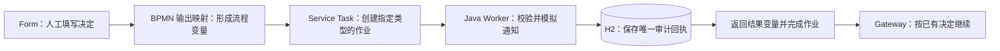

# D / Ryan：变更通知、问询回执与数据库

日期：2026-09-28。认领来源：[组长总指引](../../Est/est：外部工作器与领域数据库总指引.md)第 4.2、4.4、6 节。

同步基线 `98fad83`，工作分支 `codex/member-d-notifications`。英文正式包的实现和本地验证已完成；A／B 二责复核、团队合并仍待完成。证据：[测试、实例和数据库记录](../../evidence/PB-10_PB-21_member-D_workers_2026-09-28/README.md)。

## 1. 这次完成了什么

| 你的业务 | 新 Worker 类型 | 在图上的位置 | 数据库作用 |
|---|---|---|---|
| P11 / P12 变更、取消、随访 | `notify-care-change` | `ClinicalChange` 人工授权后，`ChangeValid` 网关前 | 保存变更通知的模拟回执；涉钱时只读支付流水 |
| P10 行政、临床、财务问询 | `ack-enquiry-routed`（组长列为可选，本次也完成） | 三个问询 User Task 各自完成后、结束前 | 保存相应问询已处理的模拟回执 |

**2 种 Worker 类型，4 个 Service Task 节点，1 个新增 Java 类。** 三种问询共用同一个 Worker，通过 `requestKind` 区分。保留现有 Forms、人工授权、网关规则及原来的付款和预约确认方法。

本次只维护 `Coursework/hospital-pathway/`。`Ruby/hospital-pathway-zh-learn/` 尚未同步这些新增能力，演示请启动英文正式包。

## 2. 你要能解释的实现链路



以终止治疗、无财务影响为例：

1. 医生在 `clinical_change.form` 选择 **Authorise stop / discharge - no financial impact**，表单提交 `action="discharge_unpaid"`。
2. `ClinicalChange` 的输出映射产生 `modificationDecision="discharge_unpaid"`、`changeTarget="discharge"`、`moneyAffected=false`。
3. 流程到新增的齿轮任务 `NotifyCareChange`。它的 `zeebe:taskDefinition type="notify-care-change"` 与 Java 注解完全一致，所以 Camunda 把作业交给这个方法。
4. Java 校验病例号、医生和决定，生成通知的模拟摘要，写入 H2 `audit_event`。保存成功才返回。
5. 返回 `careChangeNotificationSent=true`、状态 `SENT` 和回执号 `AUD-…`。框架自动完成作业。
6. 原来的授权、财务影响和下一步网关继续判断；这个示例最后结束。

**Worker 执行已作出的决定；临床授权仍由人填写。** `careChangeNotificationStatus` 是执行结果，原网关继续使用 `changeTarget`、`moneyAffected` 等原有变量。

## 3. 两个 Worker 的变量约定

### 变更通知 `notify-care-change`

| 输入 | 来源／用途 |
|---|---|
| `patientId` 或 `case_reference` | 病例号，至少一个；两个都有时必须相同 |
| `clinicianId` | 记录授权医生，必填 |
| `modificationDecision` | `reschedule_*`、`follow_up_*`、`discharge_*` 或 `invalid` |
| `changeTarget` | treatment、visit、discharge 或 invalid，须与决定一致 |
| `moneyAffected` | Boolean；已授权分支必须与 `_paid`／`_unpaid` 对应 |

| 输出 | 含义 |
|---|---|
| `careChangeNotificationSent` | 本次模拟通知是否已记录成功 |
| `careChangeNotificationStatus` | `SENT`、`SENT_FINANCE_REVIEW_REQUIRED` 或 `SKIPPED_UNAUTHORISED` |
| `careChangeNotificationReference` | `AUD-` 加审计行 ID，用于查证 |

`invalid` + `invalid` 表示缺正式授权：Worker 记录一条“跳过”，不发模拟通知，随后原网关返回补资料路径。其他不一致的输入使作业失败，修正后重试。

涉钱变更只查询本病例 `payment_ledger` 的记录数，标记 `SENT_FINANCE_REVIEW_REQUIRED`，流程仍进入原来的 Finance 人工环节。账本为空也需要 Finance 判断；Worker 不凭空生成付款或退款记录。

### 问询回执 `ack-enquiry-routed`

| `requestKind` | 读取的已记录答复 | 图上节点 |
|---|---|---|
| `enquiry_admin` | `AdminEnquiryNotes` | `AckAdminEnquiry` |
| `enquiry_clinical` | `ClinicalEnquiryNotes` | `AckClinicalEnquiry` |
| `enquiry_finance` | `FinanceEnquiryNotes` | `AckFinanceEnquiry` |

还需要病例号和 `staffRole`。答复不能为空。返回 `enquiryAcknowledgementSent=true`、`enquiryAcknowledgementReference="AUD-…"`。审计只保存问询类别、已记录答复等摘要，不复制临床答复正文。

名称沿用组长的 `ack-enquiry-routed`；当前挂接点在团队回答之后，因此这里的回执表示该问询已经处理，不表示入口刚分流时就已解决。

## 4. 数据库为什么需要参与

Camunda 自带库保存流程运行状态。应用领域库是 `Coursework/hospital-pathway/data/hospital-domain.mv.db`，保存业务事实。D 共用 B 的 H2/JPA，不另建一套数据库。

每个通知回执有键：

```text
member-D | worker类型 | 流程实例键 | 节点实例键
```

同一节点因超时或断线被重试时，键相同，直接返回已有回执。同一患者后面再次发生变更，节点实例键不同，允许新增记录。数据库唯一约束处理并发重复领取；独立事务先提交记录，之后 Worker 才向引擎报告成功。

新增 `audit_event.idempotency_key` 为可空唯一列。原四参数 `AuditEventWriter.append` 保留，B 的旧调用仍可插入 NULL 键记录。这个共享表增补已写回领域库设计，合并时请 B 复核。

这保证的是**模拟回执的防重复**。若将来接真实邮件／短信，还需要供应商幂等键或 outbox 等可靠投递设计，不能把当前代码当作真实外部邮件的“绝不重复发送”保证。

## 5. 代码应该看哪里

以下行号以本次交付文件为准。代码根目录：`Coursework/hospital-pathway/src/main/java/io/camunda/demo/hospital/`。

| 文件／行号 | 你要理解的内容 |
|---|---|
| `MemberDPathwayWorkers.java` 41–48 | 订阅 `notify-care-change`，获取流程变量，确定病例、医生和执行键 |
| 同文件 50–55 | 没有正式授权时记“跳过”，让原网关走补资料 |
| 同文件 57–72 | 校验决定与目标；读取支付记录；追加模拟通知审计；返回成功结果 |
| 同文件 75–94 | 订阅 `ack-enquiry-routed`；检查三类问询的答复；保存回执 |
| 同文件 96–115 | 结果变量、执行键和病例号校验 |
| 同文件 118–128 | 课堂用故障开关，模拟暂时不可用 |
| `domain/AuditEventWriter.java` 26–59 | 独立事务、按键查询、防并发重复、提交回执 |
| 同文件 63–79 | 防止相同键串到别的病例；保留旧 append 接口 |
| `domain/AuditEvent.java` 20–22、44–46 | 审计实体的唯一约束与新增列 |
| 全院 BPMN 469–501 | 原表单绑定、输出映射与授权网关 |
| 全院 BPMN 674–705 | 四个新服务节点以及各自的任务类型 |
| 全院 BPMN 822–841 | 新节点的顺序流连接 |

入口：[MemberDPathwayWorkers.java](../../Coursework/hospital-pathway/src/main/java/io/camunda/demo/hospital/MemberDPathwayWorkers.java)、[AuditEventWriter.java](../../Coursework/hospital-pathway/src/main/java/io/camunda/demo/hospital/domain/AuditEventWriter.java)、[全院 BPMN](../../Coursework/hospital-pathway/bpmn/W02_Hospital_All_Processes_Clean_Lines_Camunda8.bpmn)。

## 6. 约两分钟的上台演示

先启动 c8run，再在正式包目录启动 `mvn spring-boot:run`（Java 21）。只开一套 Java 工作器。应用启动会部署 BPMN 和 11 个表单。

1. Tasklist → Processes → **Hospital - All Business Processes (Simple Camunda 8)** → Start process。演示用新实例；旧实例不会因重新部署自动换图。
2. 在登记表填写虚构病例 `D-DEMO-001`，完成必填项，Request type 选择 **Authorised change / follow-up / cancellation**（值 `change`）。
3. 在变更授权表填写医生 `DEMO-CLINICIAN`、说明，选择 **Authorise stop / discharge - no financial impact**，提交。
4. Java 自动运行 `notify-care-change`，不再出现额外填表任务。到 Operate 查看该实例已结束。
5. 点历史中的 **P11 / P12 Notify care change**，说明 Job Type 是 `notify-care-change`，执行者是 `memberDPathwayWorkers#notifyCareChange`。
6. 在流程级 Variables 中搜索 `careChangeNotification`，查看成功状态和 `AUD-…` 回执号；用已保存的数据库证据展示同一病例的记录。

可选演示 P10：新开实例，登记选择行政问询；相关人员填写答复后，`ack-enquiry-routed` 自动记录回执并结束。临床和财务问询同理，继续由相应人员回答。

可直接讲：

> 我的部分覆盖问询和治疗计划变更。表单先收集人的决定，Camunda 根据任务类型调用我的 Java Worker。Worker 校验数据、模拟通知，并把病例号、操作者和结果写进 H2。记录提交后才完成任务。重复执行会复用同一回执，避免重复记录。涉及费用的变更仍交给 Finance，Java 不替医生或财务作决定。

英文：

> My part covers enquiries and changes to the care plan. The form records the human decision. Camunda then calls my Java worker using the job type. The worker checks the data, simulates the notification, and saves an audit receipt in H2 before completing the job. A retry reuses the same receipt. Financial changes still go to Finance for review.

## 7. 如何查数据库与演示重试

日常展示用[数据库证据](../../evidence/PB-10_PB-21_member-D_workers_2026-09-28/database-rows.txt)即可。需要重新查库时，先停止 Java 工作器，再用 IDE 连接同一数据库文件；`AUTO_SERVER=FALSE` 时不能另外打开一个进程占用它。查完重启工作器。连接方式见[运行说明](../../Coursework/hospital-pathway/README.md)。

```sql
SELECT id, actor, action, case_reference, occurred_at, idempotency_key, payload_summary
FROM audit_event
WHERE case_reference = 'D-DEMO-001'
ORDER BY id;
```

重试演示：在到达 Worker 之前给实例加流程变量 `memberDNotificationFailure="once"`。第一次模拟通知抛异常，Camunda 客户端发送失败命令并减少重试次数；第二次成功写一条回执。四个新节点均配置 `retries="3"`。

`once` 的已失败标记只存在当前 Java 进程内，成功回执存在 H2。若第一次失败后、成功前重启 JVM，会再次模拟一次失败。这只是课堂故障开关，不是生产重试策略。`always` 会持续失败直至 incident；需要将变量改成 `none` 后重试。正常演示省略该变量。

## 8. 已验证与待团队完成

- Java 21 / Spring Boot 4.0.5 / Camunda Client 8.9.0；本机引擎 c8run 8.10.0-alpha5。
- 20 项 Java 集成测试通过，实际使用独立 H2/JPA；覆盖防重复、并发、失败回滚、跳过授权、财务只读及旧接口兼容。
- 4 项 BPMN 检查通过；节点类型、连接和泳道引用一致。
- 8 个真实引擎实例全部结束：行政／临床／财务问询、无财务影响变更、涉钱变更、缺授权后补正、失败重试、取消就诊后变更。
- 实例通过 API 提交 User Tasks；实际表单绑定键有记录，Operate 已核对完成状态和 Java Worker。此次没有重新进行整套表单的浏览器输入验证。
- H2 有 9 条 D 审计记录（含 1 条跳过），另有 B 的 1 条占号审计；重复键组数 0；Java 重启后 10 条记录仍保留。
- 运行时支付表为空；“已有支付记录保持不变”由集成测试建立模拟流水后核对。课堂通知为 mock，未发送真实邮件或短信。
- D 本次没有新增 BPMN Message；全组 Message 示范继续看原来的 `request-payment` → `payment-result`。模拟业务通知与 BPMN Message 事件是两个概念。
- 角色来自演示表单字段；当前代码没有实现生产环境身份认证或角色权限控制。

**待 A／B 二责复核**：共享表新增列、插入节点、重试证据、代码。D 也需由本人确认至少一个其他成员 Worker 的交叉复核意见；附[对 B 的辅助检查记录](D_对B工作器的辅助检查.md)。以上不能代替同学签字，PB-10／PB-21 保持 In progress。
