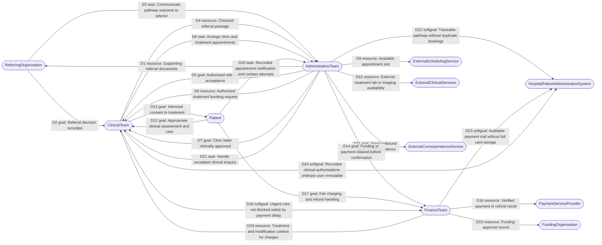

# PB-16 · i\* SD (Strategic Dependency) diagram

Companion notes: [`PB-16_istar-sd-sr.md`](PB-16_istar-sd-sr.md) · SR diagrams: [`PB-16_sr.md`](PB-16_sr.md)

## Legend (Mermaid substitution for i\* notation)

| Visual | Meaning |
|--------|---------|
| Rounded rectangle `([Name])` | Actor |
| Arrow `Depender --> Dependee` | Depender depends on Dependee |
| Edge label `Dn type: dependum` | Dependency identifier, dependum type (`goal` / `softgoal` / `task` / `resource`), and the dependum name |

i\* has no native Mermaid shapes; this legend is the mapping used throughout.

## Strategic Dependency model (initial release)

## Reading notes

- Edges point from the **depender** to the **dependee**.
- Categories required by PB-16 are all present: referring organisation (`RO`), clinical (`CL`), administrative (`AD`), financial (`FI`), and external organisations (`ESS`, `ECS`, `ECSND`, `PSP`, `FO`).
- Classroom mocks of scheduling and payment do not remove D9 or D16; they remain strategic dependencies (see assumptions in the notes file).
)
