# PB-16 · i\* SR (Strategic Rationale) diagrams

Companion notes: [`PB-16_istar-sd-sr.md`](PB-16_istar-sd-sr.md) · SD diagram: [`PB-16_sd.md`](PB-16_sd.md)

## Legend (Mermaid substitution for i\* notation)

| Visual | Meaning |
|--------|---------|
| Rounded rectangle `([Name])` | Actor boundary |
| Stadium / rounded node inside an actor | Goal, softgoal, task or resource (label states the kind) |
| Solid arrow inside an actor | Means-ends / decomposition link (element supports or provides another) |
| Dashed arrow leaving an actor | Strategic dependency, labelled with the SD identifier `Dn` |

Diagrams are split by actor so each graph stays readable. Every dashed edge cites an SD dependency from [`PB-16_sd.md`](PB-16_sd.md). Softgoals that are **not** committed initial-release product features are listed in the notes file Section 8 and are omitted from these graphs except where a softgoal is required to justify an in-scope dependency (for example D22–D24).

---

## SR-1 · ReferringOrganisation

SD links: **D1** (provides), **D2**, **D3**.

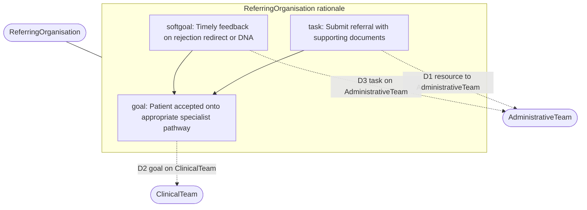

---

## SR-2 · Patient

SD links: **D12**, **D13** (provides), **D17**, **D20**.

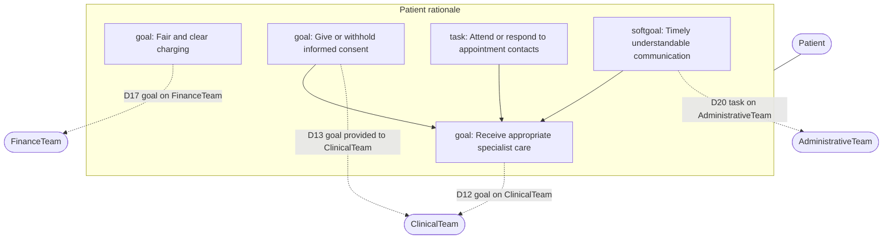

---

## SR-3 · ClinicalTeam

SD links: **D2** (provides), **D4**, **D5**–**D7** (provides), **D8**, **D12** (provides), **D13**, **D18**, **D19** (provides), **D21** (provides), **D24**.

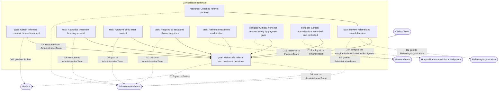

---

## SR-4 · AdministrativeTeam

SD links: **D1**, **D3** (provides), **D4** (provides), **D5**–**D7**, **D8** (provides), **D9**–**D11**, **D14**, **D20** (provides), **D21**, **D22**.

```mermaid
flowchart TB
  AD([AdministrativeTeam])
  subgraph AD_boundary[AdministrativeTeam rationale]
    AD_G1[goal: Keep pathway moving within clinical authorisations]
    AD_T1[task: Check referral documents and request missing items]
    AD_T2[task: Book clinic and treatment appointments]
    AD_T3[task: Notify patient and record contact attempts]
    AD_T4[task: Distribute approved clinic letters]
    AD_T5[task: Route enquiries and escalate clinical matters]
    AD_T6[task: Communicate pathway outcome to referrer when required]
    AD_R1[resource: Authorised referral acceptance]
    AD_R2[resource: Authorised treatment booking request]
    AD_R3[resource: Available appointment slot]
    AD_R4[resource: External clinical service availability]
    AD_SG1[softgoal: No duplicate bookings when external services fail]
    AD_T1 --> AD_G1
    AD_R1 --> AD_T2
    AD_R2 --> AD_T2
    AD_R3 --> AD_T2
    AD_R4 --> AD_T2
    AD_T2 --> AD_G1
    AD_T3 --> AD_G1
    AD_T4 --> AD_G1
    AD_T5 --> AD_G1
    AD_T6 --> AD_G1
    AD_SG1 --> AD_G1
  end
  AD --- AD_boundary
  RO([ReferringOrganisation])
  CL([ClinicalTeam])
  ESS([ExternalSchedulingService])
  ECS([ExternalClinicalServices])
  ECSND([ExternalCorrespondenceService])
  FI([FinanceTeam])
  PT([Patient])
  HPAS([HospitalPatientAdministrationSystem])
  AD_T1 -.->|D1 resource on ReferringOrganisation| RO
  AD_T6 -.->|D3 task to ReferringOrganisation| RO
  AD_T1 -.->|D4 resource to ClinicalTeam| CL
  AD_R1 -.->|D5 goal on ClinicalTeam| CL
  AD_R2 -.->|D6 resource on ClinicalTeam| CL
  AD_T4 -.->|D7 goal on ClinicalTeam| CL
  AD_T2 -.->|D8 task to ClinicalTeam| CL
  AD_R3 -.->|D9 resource on ExternalSchedulingService| ESS
  AD_R4 -.->|D10 resource on ExternalClinicalServices| ECS
  AD_T3 -.->|D11 task on ExternalCorrespondenceService| ECSND
  AD_T4 -.->|D11 task on ExternalCorrespondenceService| ECSND
  AD_G1 -.->|D14 goal on FinanceTeam| FI
  AD_T3 -.->|D20 task to Patient| PT
  AD_T5 -.->|D21 task on ClinicalTeam| CL
  AD_SG1 -.->|D22 softgoal on HospitalPatientAdministrationSystem| HPAS
```

---

## SR-5 · FinanceTeam

SD links: **D14** (provides), **D15**, **D16**, **D17** (provides), **D18** (supports), **D19**, **D23**.

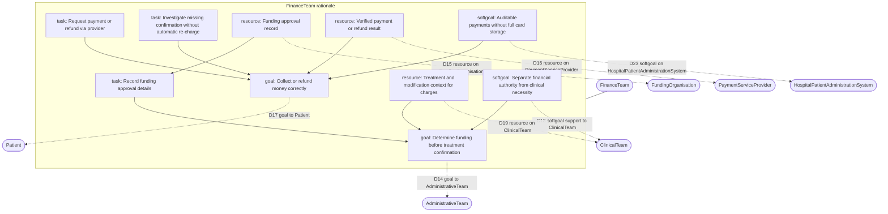

---

## SR-6 · ExternalSchedulingService

SD links: **D9** (provides).

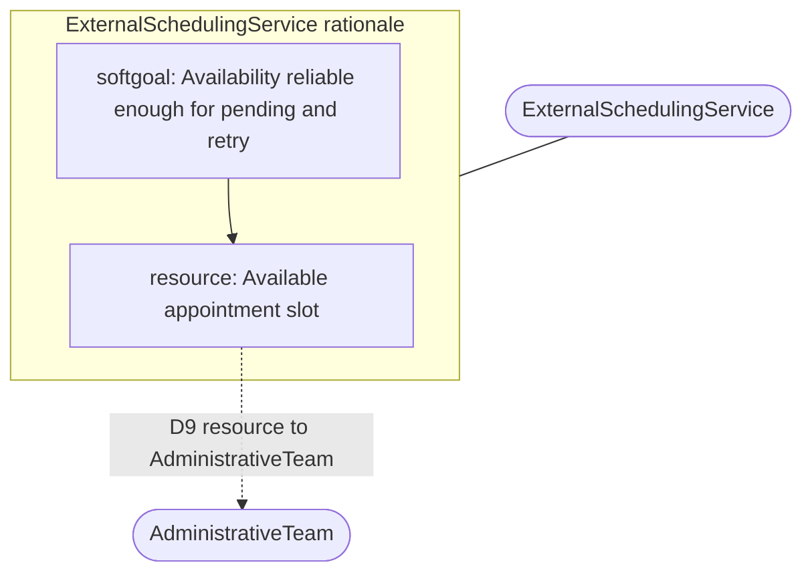

---

## SR-7 · ExternalClinicalServices

SD links: **D10** (provides).

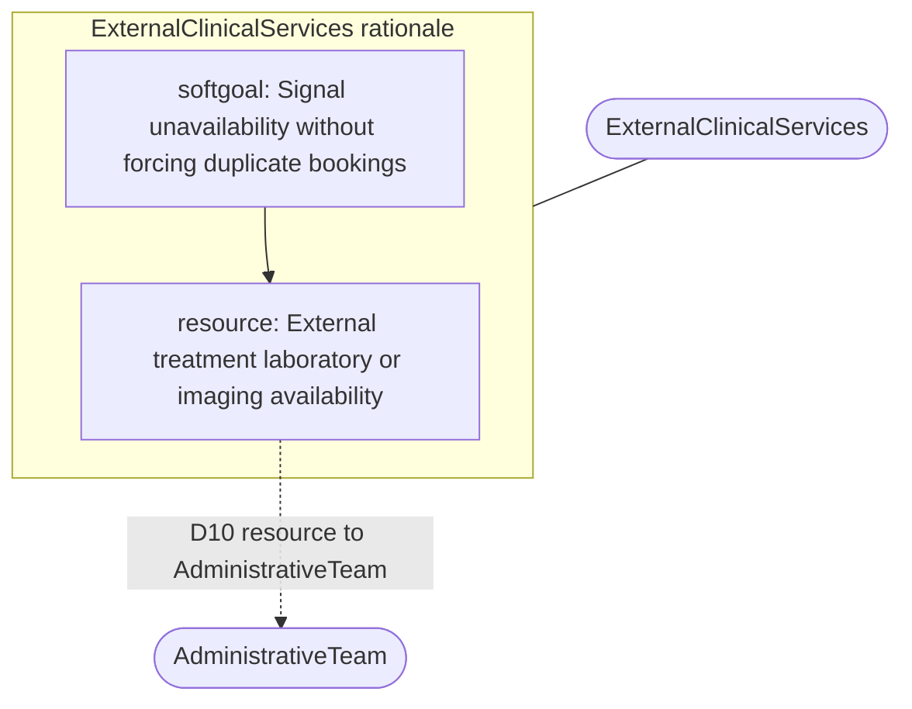

---

## SR-8 · ExternalCorrespondenceService

SD links: **D11** (provides).

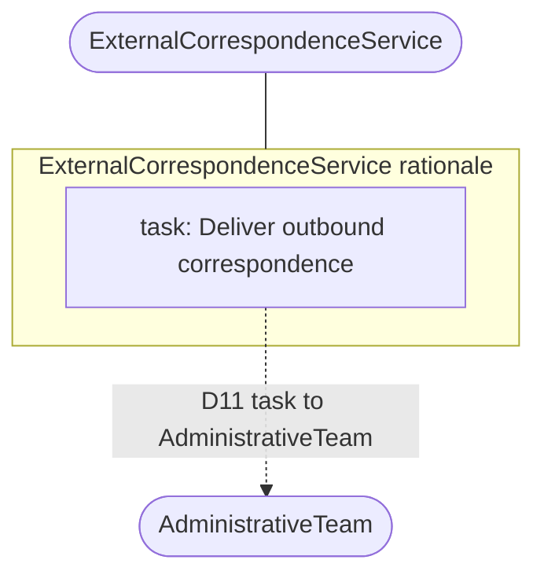

---

## SR-9 · PaymentServiceProvider

SD links: **D16** (provides).

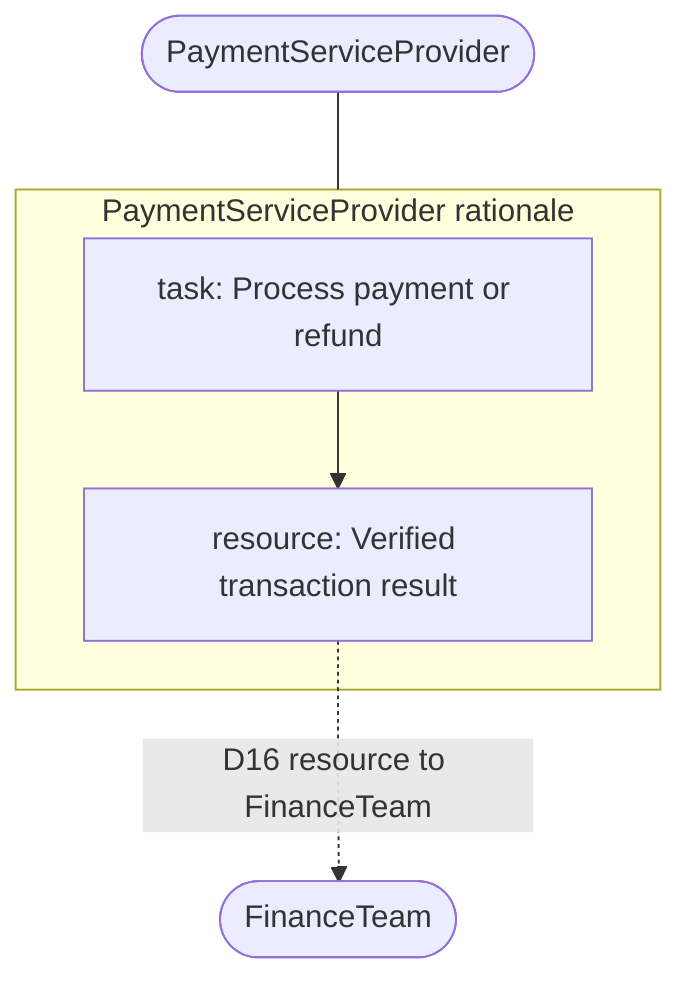

---

## SR-10 · FundingOrganisation

SD links: **D15** (provides).

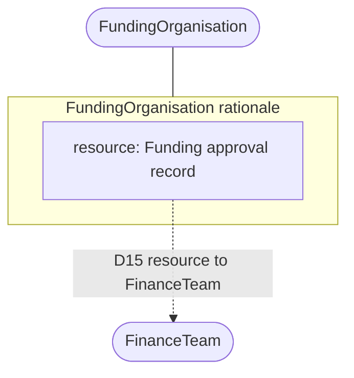

---

## SR-11 · HospitalPatientAdministrationSystem

SD links: **D22**, **D23**, **D24** (provides softgoal satisfaction to depender actors).

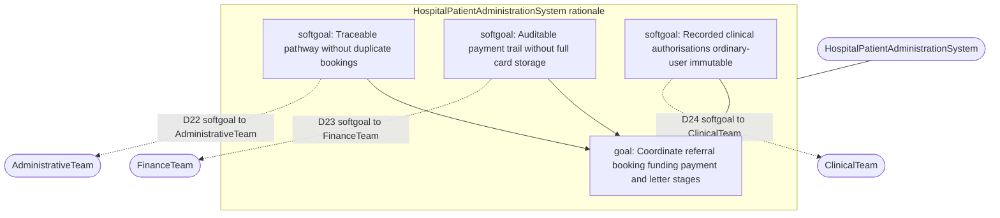

---

## Cross-check checklist (automatable by search)

Search this file for `D1` through `D24`. Each identifier must appear at least once in a dashed dependency edge label. The authoritative direction and dependum text remain those in [`PB-16_sd.md`](PB-16_sd.md) and the catalogue in [`PB-16_istar-sd-sr.md`](PB-16_istar-sd-sr.md).
)
