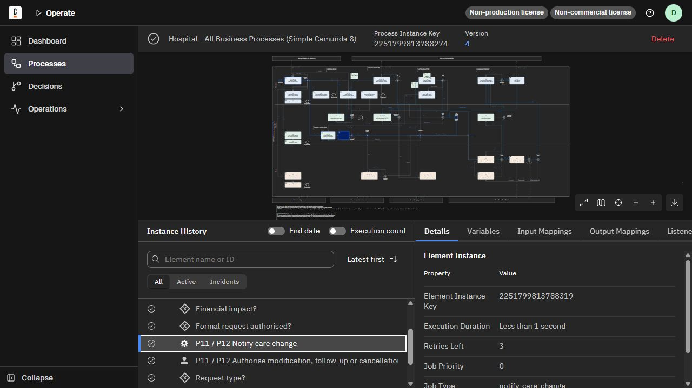

# Member D worker execution evidence — 2026-09-28

Owner: D / Ryan. Baseline: `98fad83`. Formal package: `Coursework/hospital-pathway/`. This evidence covers D's notification increment; A/B second-owner review remains pending. It does not certify every PB-10/PB-21 acceptance condition or all other members' routes.

## Build and structural tests

- Java 21, Spring Boot 4.0.5, Camunda Java starter 8.9.0, H2 2.4.240.
- `mvn test`: **20 tests, 0 failures, 0 errors**; [Surefire summary](java-tests.txt).
- `python scripts/test_member_d_bpmn.py`: **4 tests passed**; [output](bpmn-tests.txt).
- The initial test-first run against nonfunctional scaffolding had 17 tests, 16 assertion failures and 0 errors. After implementation 17 passed; three extra rollback/restart/collision checks brought the final suite to 20.
- Tests use real JPA/H2 persistence and mock only the ActivatedJob boundary. They do not connect to the user's file database.

## Real local engine runs

Engine: c8run 8.10.0-alpha5 on localhost. Deployment key `2251799813788036`, process definition key `2251799813788037`, version 4. BPMN and all 11 forms deployed. Reopening the application for persistence verification redeployed the same files with deployment key `2251799813788961`.

Final Modeler-saved diagram formatting was deployed with all 11 forms as version 5, deployment `2251799813789435`. [Final deployment verification](final-deployment.json) confirms the deployed XML matches the local file; its executable process content matches the eight tested version-4 instances. The diagram coordinates/label layout and XML order changed without changing routing or worker bindings.

| Scenario | Process instance key | Outcome |
|---|---|---|
| Administrative enquiry | 2251799813788121 | COMPLETED, AUD-1 |
| Clinical enquiry | 2251799813788172 | COMPLETED, AUD-2 |
| Finance enquiry | 2251799813788223 | COMPLETED, AUD-3 |
| Authorised change, no finance impact | 2251799813788274 | COMPLETED, AUD-4 |
| Change requiring Finance review | 2251799813788335 | COMPLETED after Finance user task, AUD-5 |
| Missing approval, then corrected | 2251799813788419 | SKIPPED/AUD-6 before documents loop; COMPLETED/AUD-7 after correction |
| Transient notification failure | 2251799813788532 | Failed delivery then successful retry; COMPLETED, one receipt AUD-8 |
| Route 14: cancel visit, authorise change | 2251799813788642 | COMPLETED, AUD-10; B check-slot produced AUD-9 |

All eight instances have zero active incidents. Other pre-existing local instances were left unchanged, including an unrelated old referral incident.

[First seven scenarios](runtime-7-scenarios.json) and [route 14](runtime-route14.json) record actual user-task keys, bound form keys, completion states and output variables. Task completions used the Camunda API with synthetic data, not browser form inputs. The current reusable smoke script includes all eight scenarios in one run.

## Database and retry evidence

- [Database rows](database-rows.txt): queried the actual shared file H2 in read-only mode after stopping only the formal Java worker; restarted it immediately afterwards.
- 10 matching audit rows: 9 owned by D, 1 by B. Zero duplicate non-null idempotency keys. One booking row and zero payment rows in this local snapshot.
- The paid-change scenario demonstrates Finance routing with an empty ledger. Read-only preservation of an existing payment row is covered separately by the Java integration test.
- [Notification log](notification-runtime.txt): both D subscriptions, successful receipts, simulated failure and retry for job `2251799813788578`.
- [Restart log](restart-persistence.txt): 10 audit rows still present after Java restart; both D job types subscribed.
- [Notification variables screenshot](operate-notification-variables.png): process-level receipt `AUD-4`, sent=true and status SENT.
- [Operate screenshot](operate-change-completed.png): completed change instance with the new service task selected. The Details panel identifies the job type and worker; actual engine execution was also checked through the API.

## Scope and reproduction

Notifications are mocks persisted as audit receipts. No real email or SMS is sent and no new BPMN Message is published by D. The optional learning package has not been synchronized. See [D's explanation](../../Ryan/2026-09-28/D_外部工作器与数据库说明.md) and [module README](../../Coursework/hospital-pathway/README.md) for commands, variables, database inspection and the presentation route.

The shared optional `audit_event.idempotency_key` and its unique constraint are an additive change for B to review. The original append signature and original payment/booking worker methods remain intact. Final team review and merge are pending; this folder is execution evidence, not a human review signature.
